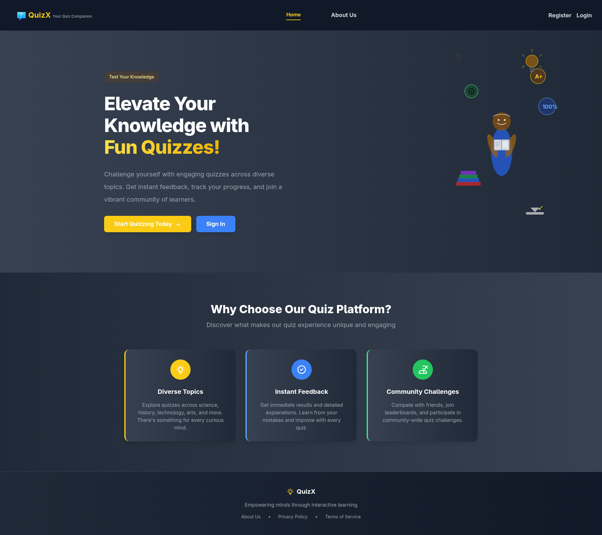

# Quiz Management System

A modern full-stack quiz application built with React and TypeScript for the frontend and Node.js for the backend. This comprehensive platform allows users to create, manage, and attempt quizzes with real-time scoring and detailed analytics.

## Features

### Core Functionality

- **User Authentication**: Secure login system with JWT tokens
- **Quiz Creation**: Create custom quizzes with multiple-choice questions (Only Admin can create)
- **Quiz Attempts**: Interactive quiz-taking interface with real-time feedback
- **Scoring System**: Automatic grading with detailed score breakdown
- **User Management**: Browse registered users and view profiles
- **Progress Tracking**: Track quiz performance and completion rates

### UI/UX Features

- **Modern Design**: Beautiful gradient backgrounds and card-based layouts
- **Responsive Interface**: Seamless experience across all devices
- **Interactive Elements**: Smooth animations and hover effects
- **Dark Mode Support**: Built-in theme switching capability
- **Real-time Feedback**: Instant score display upon quiz completion
- **Progress Indicators**: Visual progress bars and completion status

## Tech Stack

### Frontend

- **React 18+** - Modern React with hooks and functional components
- **TypeScript** - Type-safe JavaScript for better development experience
- **React Hook Form** - Efficient form handling and validation
- **Tailwind CSS** - Utility-first CSS framework for rapid styling
- **React Router** - Client-side routing and navigation
- **Axios** - HTTP client for API communication
- **Vite** - Lightning-fast build tool and development server

### Backend

- **Node.js** - JavaScript runtime environment
- **Express.js** - Minimal web framework for APIs
- **JWT** - JSON Web Tokens for secure authentication
- **MongoDB** - NoSQL database for flexible data storage

## Prerequisites

Ensure you have the following installed:

- **Node.js** (v16 or higher)
- **npm** or **yarn** package manager
- **MongoDB** database server
- **Git** for version control

## Getting Started

### 1. Clone the Repository

### 2. Backend Setup

```bash
# Navigate to backend directory
cd backend

# Install dependencies
npm install

# Create environment variables file
cp .env.example .env

# Configure your environment variables:
# PORT=3000
# JWT_SECRET=your-super-secret-jwt-key
# MONGODB_URI=mongodb://localhost:27017/quizdb
# NODE_ENV=development

# Start the backend server
npm start
# or for development with auto-reload
npm run dev
```

The backend server will run on `http://localhost:3000`

### 3. Frontend Setup

```bash
# Navigate to frontend directory (from project root)
cd frontend

# Install dependencies
npm install

# Create environment file (if needed)
# VITE_API_BASE_URL=http://localhost:3000

# Start the development server
npm run dev
```

The frontend application will start on `http://localhost:5173`

## Security Features

- **JWT Authentication**: Secure token-based authentication
- **Protected Routes**: Frontend and backend route protection
- **Input Validation**: Comprehensive form validation and sanitization
- **CORS Configuration**: Proper cross-origin resource sharing setup
- **Secure Headers**: Security headers for API protection

### Database Setup

- Set up MongoDB Atlas for cloud database
- Configure connection strings for different environments
- Set up database indexes for optimal performance

### Screenshots

## Features

### UnAuthHome Page System



### Auth Home Page

.png>)

### Profile Page (Admin View)

.png>)

### Question Set Dashboard

.png>)

### Create Question Set

.png>)

### Take Quix Page


